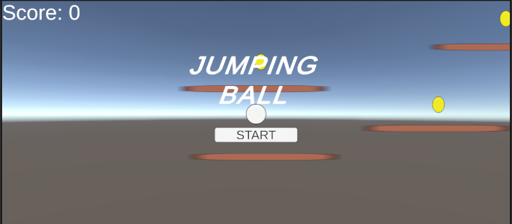
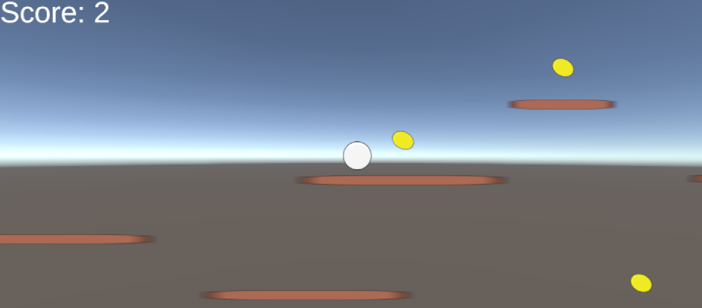
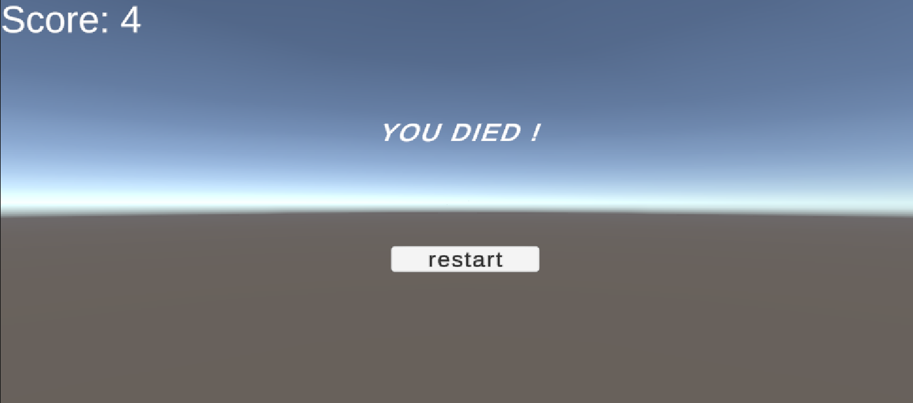

# UnityGame
Unity游戏作品集

## 项目简介
这是一个基于 Unity 开发的 2D平台跳跃游戏。玩家需要操控角色通过障碍物并收集金币。

## 核心功能
* **物理系统**：基于 Rigidbody2D 实现的平滑移动与跳跃。
* **收集机制**：动态金币收集与 UI 分数实时更新。
* **关卡设计**：包含陷阱检测与角色复活逻辑。

## 开发环境
* **引擎**：Unity 2022.3 (LTS)
* **语言**：C#
